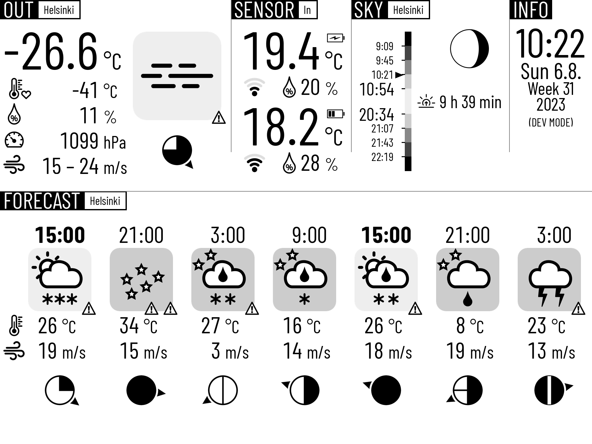

# Raspberry Pi e-Ink Weather Data Display

This application is a project for building a weather data display using [Raspberry Pi](https://www.raspberrypi.org/products/), [Waveshare e-Paper Display](https://www.waveshare.com/product/raspberry-pi/displays/e-paper.htm) and [RuuviTag sensors](https://ruuvi.com/ruuvitag-specs/). The goal of the project is to have an e-Ink display showing:

- Current weather observations (temperature, windspeed, humidity etc.)
- 48h weather forecast
- Weather data from RuuviTag sensors
- Sunrise and sunset times
- Different twilight times: astronomical, nautical and civil dusk and dawn
- "Feels like" temperature

See a [demo video](https://www.youtube.com/watch?v=s2YX_JOI1VU) on YouTube.

The current hardware:

- [Raspberry Pi 3 Model B+](https://www.raspberrypi.org/products/raspberry-pi-3-model-b-plus/) computer
- [Waveshare 10.3" e-Paper HAT](https://www.waveshare.com/product/raspberry-pi/displays/e-paper/10.3inch-e-paper-hat.htm) e-Ink display (also works with the similar 7.8" display)
- [RuuviTag](https://ruuvi.com/ruuvitag-specs/) sensors

Note: This device/software is heavily customized to be used with the FMI (Finnish Meteorological Institute) Open API data which - in turn - is heavily targeted for people living in Finland. Other APIs might require extensive changes.

## Weather Display

The image below shows the display with fake data. It was a design decision to keep the information density quite high so that one display could show as much relevant information as possible.

## Development and Deployment

The development can be done on the host machine and the app can be deployed remotely using the provided scripts.

For detailed instructions on how to setup RaspberryPi and install all dependencies, please see [Full Instructions](full_install.md). If you have Raspberry Pi up and running, skip to section [Install base dependencies](full_install.md#install-base-dependencies).

The script [scripts/deploy.sh](scripts/deploy.sh) is a small helper which copies all the files over SSH to Raspberry Pi, activates venv and starts the application remotely. The script [scripts/compile.sh](scripts/compile.sh) allows compiling the shared C libraries on Raspberry Pi. The script [scripts/convert.sh](scripts/convert.sh) allows converting SVG icons to PNG format to be used by the application.

Note: Scripts won't work unless dependencies are installed.

## Observations and forecast data

The application shows real time weather observations and near term forecast data from the [open API by FMI](https://en.ilmatieteenlaitos.fi/open-data). The API offers accurate data updated regularly based on the given location.

## RuuviTag data

RuuviTag sensors measure temperature, barometric pressure and humidity every few seconds and broadcast it using Bluetooth 5. This data is read by Raspberry Pi and further showed on the display.

## Celestial data

The application shows sunrise and sunset times and the phase of the Moon. These are calculated using [PyEphem library](https://rhodesmill.org/pyephem/).

## Weather icons

This repository contains a custom set of [weather icons](svg_icons/README.md) to be used with the application. The icon set also contains icons for showing the moon phase, RuuviTag battery charge level.

The data from FMI API includes [WaWa and WeatherSymbol3](weather_icon_codes.md) codes which can be used to show a weather icon or a description to the user. There are a lot of free weather icons or icon fonts available in the Internet but it is hard to find one which covers all the codes FMI uses. For this reason I have created a set of weather icons for this need.

The weather icon set contains a unique icon for almost all weather codes. The icons were drawn programmatically in svg. Because the PILLOW library doesn't support SVG format, the icons have to be converted to PNG images using the provided [script](scripts/convert.sh) before usage.

The icons contain night variants for some icons. The night varian is used when the observation/forecast time is determined to happen after sunset but before sunrise - commonly know as "during the night".

## Future plans

The prototype worked well using Waveshare 3.7" HAT display. The natural next step was to go bigger. The [Waveshare 7.8" E-Ink display](https://www.waveshare.com/product/raspberry-pi/displays/e-paper/7.8inch-e-paper-hat.htm) has a resolution of 1872 x 1404 pixels - almost 20x as much pixels as the 3.7" display has. The larger display refreshes faster (0.45 s vs 3.0 s) and supports 4-bit gray scales as opposed to 2-bit on 3.7". The larger physical size and resolution allows showing bigger digits and icons and add more information - such as _rainfall_ and _cloud amount_.

The 7.8" display comes only with C code for controlling it using the [BCM 2835 GPIO driver](https://www.airspayce.com/mikem/bcm2835/). For that reason the original 3.7" implementation has been modified to work with a library written in C for operating the display. The included shared library [eInk-weather-display/lib/epd37.so](eInk-weather-display/lib/epd37.so) handles operating the display and is called using [ctypes](https://docs.python.org/3/library/ctypes.html) from Python.

Support for the 7.8" eInk has been added. The shared library [eInk-weather-display/lib/epd78.so](eInk-weather-display/lib/epd78.so) manages image bit depth operations and drawing the data on 7.8" eInk display.

## Used licenses

See the [eInk-weather-display/fonts/README.md](eInk-weather-display/fonts/README.md) for information about fonts used in this project and their licenses.

See the files in [eInk-weather-display/lib](eInk-weather-display/lib) directory for their respective license info.

The licenses of C library files can be found in the files in directory [clib](clib)
