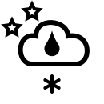
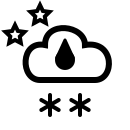

# Icons

This is a set of custom made icons to be used with FMI observation and forecast data. The icons are drawn programmatically - not with an SVG editor. Some icons have day and night variants. There are still some icons missing. Those will be added later.

Note that the icons will look a bit odd if you use Dark Mode. They are meant to be displayed on a white background.

## Weather icons

## Miscellaneous icons

