# Icons

This is a set of custom made icons to be used with FMI observation and forecast data. The icons are drawn programmatically - not with an SVG editor. Some icons have day and night variants. There are still some icons missing. Those will be added later.

## Weather icons

### General

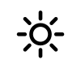

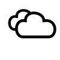
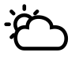
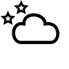

### Drizzle (+ with icing)

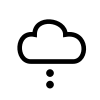

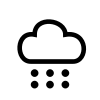
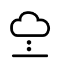

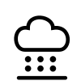

### Fog and mist

### Hail

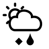
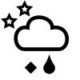

### Rain (+ with icing)

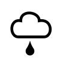
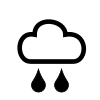
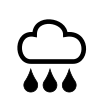
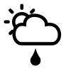
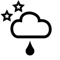
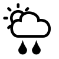
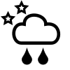
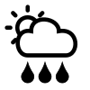
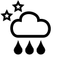
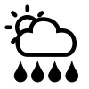
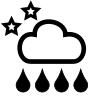
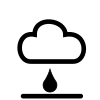

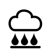

### Sleet

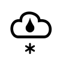
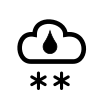
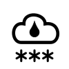
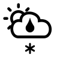
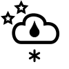
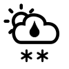
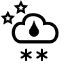

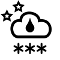

### Snow

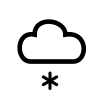
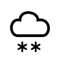
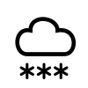
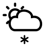
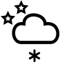

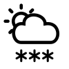
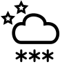

### Thunder

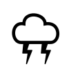
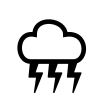
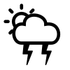
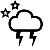
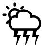
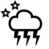

## Miscellaneous

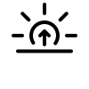
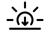
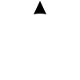

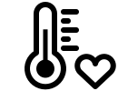
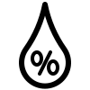

## Battery icons

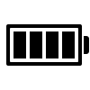

## Cloud cover

