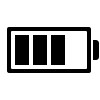
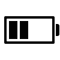

# Icons

This is a set of custom made icons to be used with FMI observation and forecast data. The icons are drawn programmatically - not with an SVG editor. Some icons have day and night variants. There are still some icons missing. Those will be added later.

## Weather icons

### General

### Drizzle (+ with icing)

### Fog and mist

### Hail

### Rain (+ with icing)

### Sleet

### Snow

### Thunder

### Snow

### Sleet

## Miscellaneous

## Battery icons

## Cloud cover

